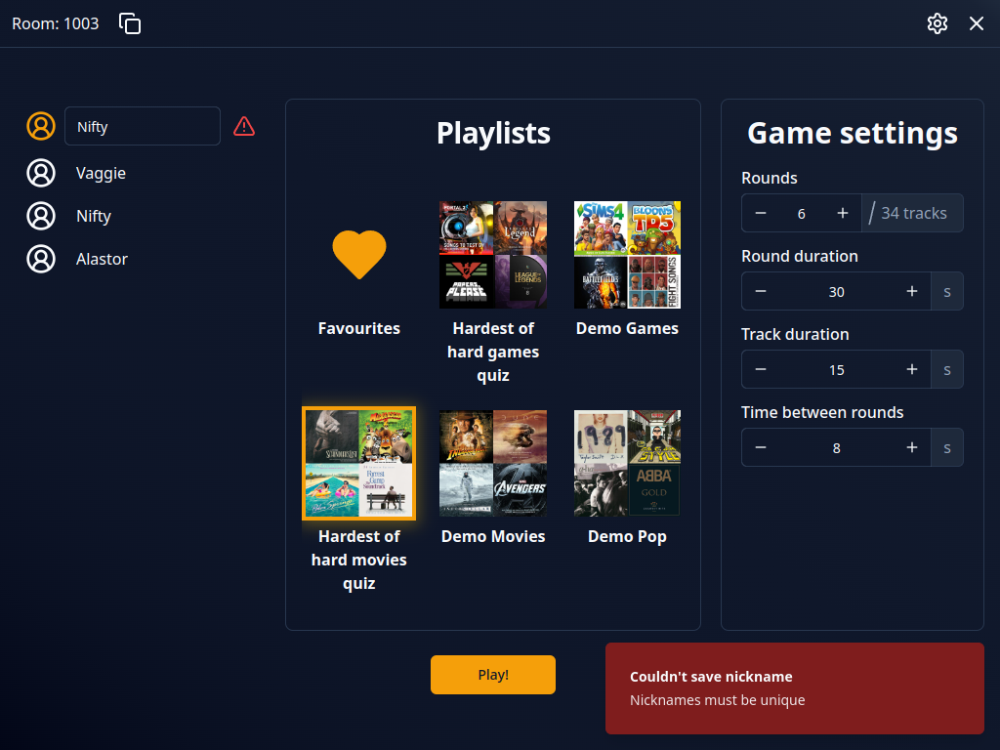
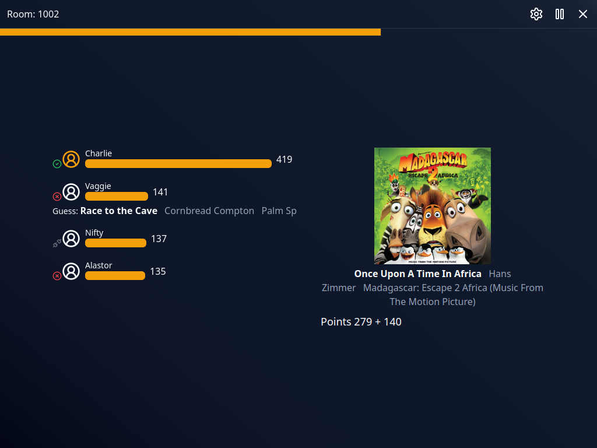
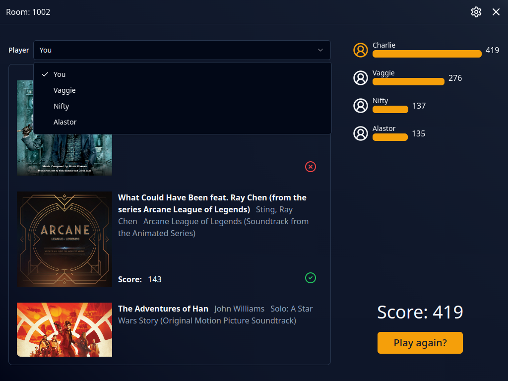
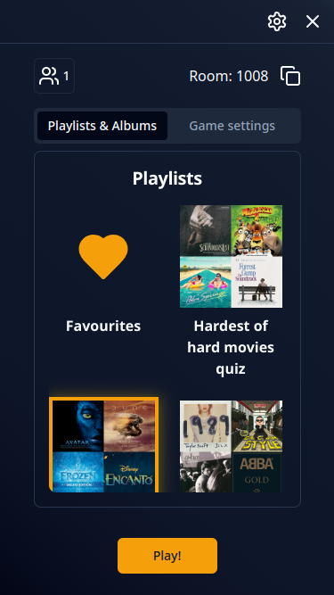
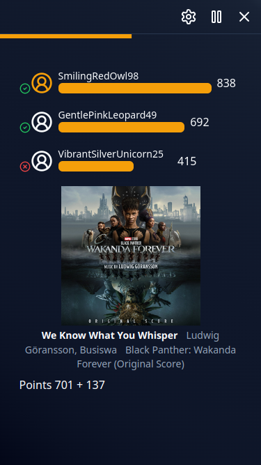

# Changelog

## v3.2.0 (2024-06-22)

## UI improvements

Done many quality of life changes in setup view, some of the most notable:
- New game settings form displays units and how many tracks are selected
- Loading playlists and albums is now non blocking, game settings form can be edited while waiting
- Changed player nickname form to better display errors and allow users to fix them
- Nicknames are now saved locally and loaded after joining room (if they are not conflicting with existing players)

## Better round results

Round results now show other players guesses if they sent an incorrect one and special icon for disconnected players

## Other players game results

On results page users can now check in detail how game went for other players

## Play again

Clicking "Play Again" now works as expected, another game can be started in the same room and players keep connection. It works only if host doesn't disconnect, otherwise new room must be created.

**Full Changelog**: https://github.com/kaczkadevteam/harmonify/compare/v3.1.0...v3.2.0

## v3.1.0 (2024-06-13)

## Mobile

Game now supports mobile, tablet and small desktops UI. This change brings also many quality of life and bugfixes to original UI.

## Pause

Room host can now pause game, no more missing tracks for person going AFK

## Quitting

Players can now quit game properly which removes them from leaderboard for other players. If left in the middle of the game it displays results so far for leaving player

## Autoplay

Add setting to change how autoplay behaves during round, possible options are: always, once and never.

---

**Full Changelog**: https://github.com/kaczkadevteam/harmonify/compare/v3.0.0...v3.1.0

## v3.0.0 (2024-05-29)

## Multiplayer

Game now supports multiplayer gameplay! To achieve this we developed [API service](https://github.com/kaczkadevteam/harmonify-api) and changed most of app logic.

## Music player

App no longer uses Spotify Web Playback SDK (player in browser) to play music, now its based on 30 second MP3 previews. **Thanks to this, a premium account is no longer required to create a room, and room guests don't have to connect to Spotify at all.**

## New Contributors
* @FilipTarajko made their first contribution in https://github.com/kaczkadevteam/harmonify/pull/17

## v2.0.0 (2024-04-18)

## Migration

Migrate from Next.js to Vue, refactor code to be more clear, improve UI a little

## v1.1.0 (2024-03-21)

## Game results

Now, after the game, the user is given list of tracks that were in the game, along with results: whether they guessed correctly, the time it took, or if they did not guess correctly, what mistake they made.

## Round settings

Before the game starts, now you can adjust settings like number of rounds, round duration and track duration.

## Skip button

Previously there was no way to jump to another track without giving a guess, but no more: welcome the skip button!

## v1.0.0 (2024-02-01)

## What's changed

-   ✨ Finish all milestones required before v1.0.0 release

## Achieved milestones

-   Core features
-   Code Refactorization
-   Polish UI
-   Quality of life
