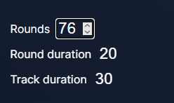
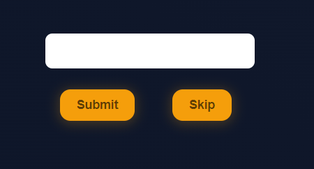

# Changelog

## v1.1.0 (2024-03-21)

## Game results

Now, after the game, the user is given list of tracks that were in the game, along with results: whether they guessed correctly, the time it took, or if they did not guess correctly, what mistake they made.

## Round settings

Before the game starts, now you can adjust settings like number of rounds, round duration and track duration.

## Skip button

Previously there was no way to jump to another track without giving a guess, but no more: welcome the skip button!

## v1.0.0 (2024-02-01)

## What's changed

-   ✨ Finish all milestones required before v1.0.0 release

## Achieved milestones

-   Core features
-   Code Refactorization
-   Polish UI
-   Quality of life
