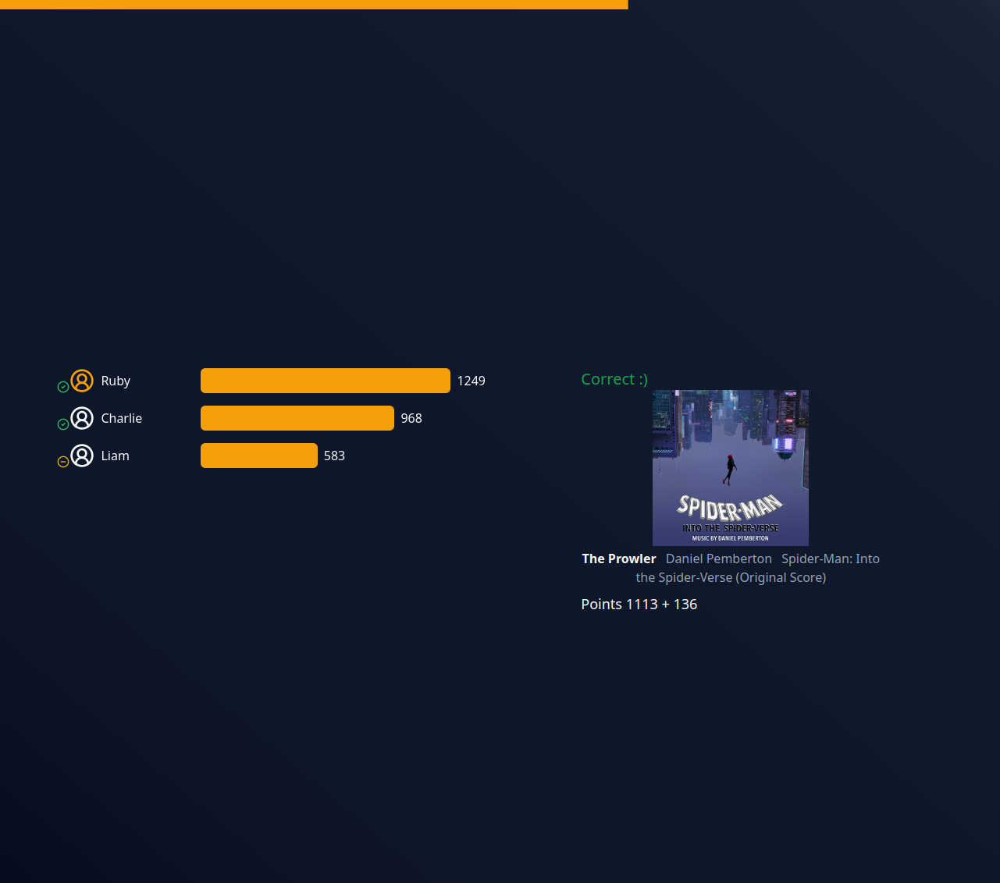
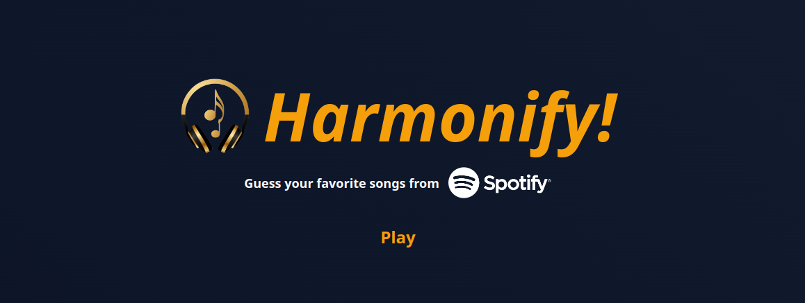

# Changelog

## v3.0.0 (2024-05-29)

## Multiplayer

Game now supports multiplayer gameplay! To achieve this we developed [API service](https://github.com/kaczkadevteam/harmonify-api) and changed most of app logic.

## Music player

App no longer uses Spotify Web Playback SDK (player in browser) to play music, now its based on 30 second MP3 previews. **Thanks to this, a premium account is no longer required to create a room, and room guests don't have to connect to Spotify at all.**

## New Contributors
* @FilipTarajko made their first contribution in https://github.com/kaczkadevteam/harmonify/pull/17

## v2.0.0 (2024-04-18)

## Migration

Migrate from Next.js to Vue, refactor code to be more clear, improve UI a little

## v1.1.0 (2024-03-21)

## Game results

Now, after the game, the user is given list of tracks that were in the game, along with results: whether they guessed correctly, the time it took, or if they did not guess correctly, what mistake they made.

## Round settings

Before the game starts, now you can adjust settings like number of rounds, round duration and track duration.

## Skip button

Previously there was no way to jump to another track without giving a guess, but no more: welcome the skip button!

## v1.0.0 (2024-02-01)

## What's changed

-   ✨ Finish all milestones required before v1.0.0 release

## Achieved milestones

-   Core features
-   Code Refactorization
-   Polish UI
-   Quality of life
