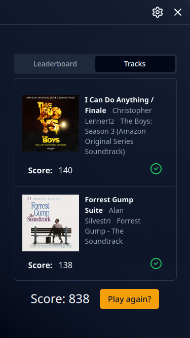

## Description

Web app for playing the "Name that tune" game with playlists and albums from user's Spotify collection.
**Usage is heavily limited, see [Notice](#notice).**

## Features

- Multiplayer guessing game
- Loading all of host's playlists and albums
- Host selects tracks from albums and playlists
- Game consists of multiple rounds, in each one track to guess
- Guessing done with autocomplete bar where user can search by title, author or album
- Support for keyboard only gameplay
- Points calculated based on how fast player guessed (partial points for guessing only album or artist)

## Showcase

 

 

 

 

## Notice

The app, unfortunately, will never leave development mode due to Spotify's ToS (unless I change API in the future 🫣). Therefore, player can only join existing rooms not create ones, unless you send me your email associated with Spotify account and I add it to developer dashboard.

---

### Used technologies

